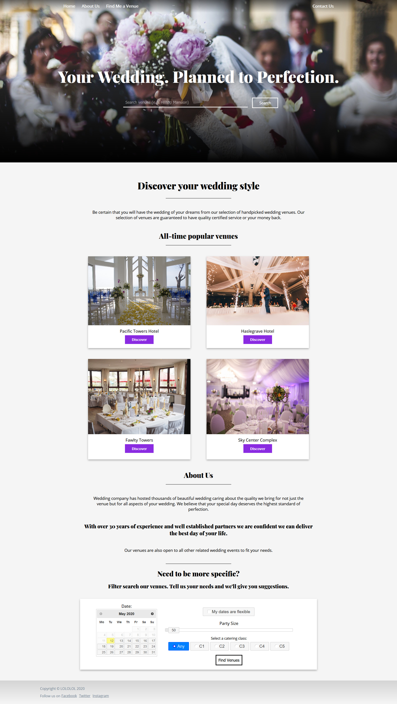
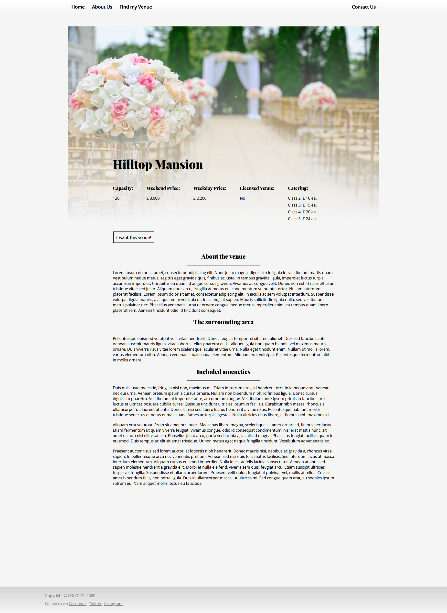

# web-dev-coursework
A wedding booking website I've made for web development course.

## This repository is for archival purposes only.
This website relies on my university's database; therefore this is non functional.
The file structure was restricted by the coursework specifications, **I would not do this otherwise.**

## Screenshots of the functional website
| Home Page                            | Venue Specific Page                      |
|--------------------------------------|------------------------------------------|
|  |  |
